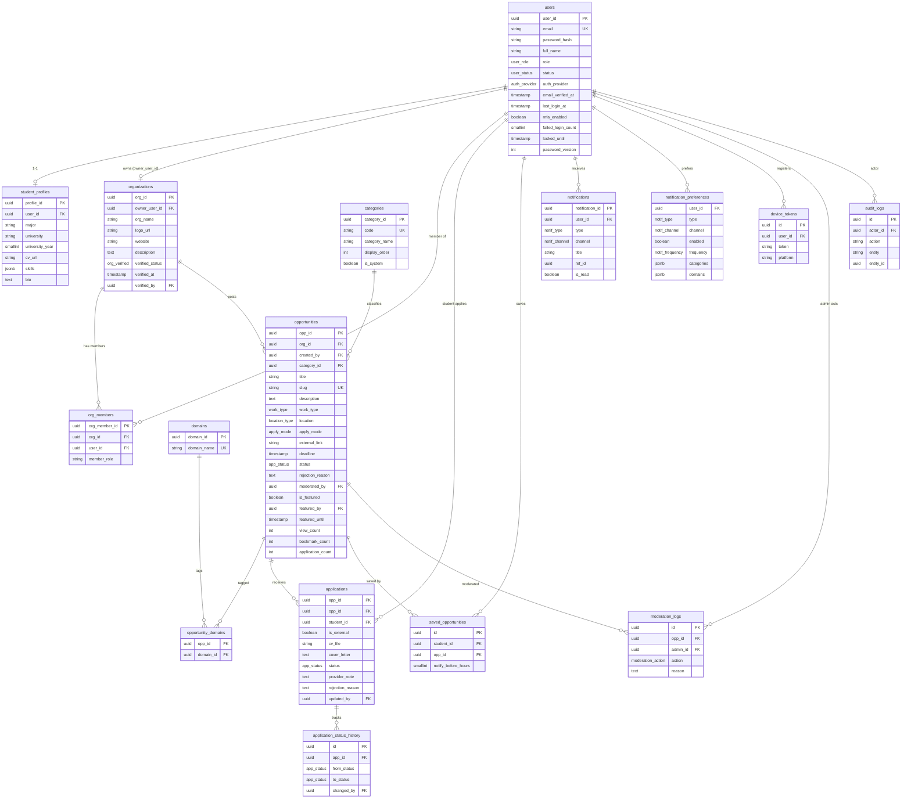

# ENTITY RELATIONSHIP DIAGRAM — Opportunity Board

> Sinh từ `docs/db/schema.sql` (PostgreSQL). Mermaid ER diagram.

## Chú thích ràng buộc quan trọng

- `applications UNIQUE(opp_id, student_id)` — chặn nộp trùng (S5).
- `opportunities CHECK`: nếu `apply_mode=EXTERNAL` thì `external_link` bắt buộc (Mục 4).
- `opportunities CHECK`: `deadline > created_at`.
- `saved_opportunities.notify_before_hours` trong [24,48].
- `opportunity_display_status` VIEW: tách status lưu (DRAFT/PENDING/APPROVED/...) khỏi status hiển thị (OPEN/CLOSING_SOON/EXPIRED/HIDDEN).
- Quan hệ sở hữu: `applications.opp_id → opportunities.org_id → organizations(owner_user_id / org_members)` — dùng enforce RBAC chống IDOR.
